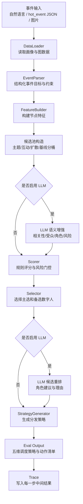

# 影响力事件分发策略生成项目流程与技术说明

## 1. 项目定位

本项目是一个围绕“影响力事件分发策略生成”的 Python 原型系统。它的目标不是商品推荐，也不是连接真实社交平台自动发布内容，而是基于本地匿名用户画像、互动图结构和事件输入，生成一份可解释、可追踪、结构化的模拟分发策略。

系统要回答的核心问题是：

- 给定一条事件或热点议题，应该选择哪些匿名数字人节点参与传播。
- 每个数字人节点应该承担什么角色，例如首发、互动承接、扩散、支持。
- 每个节点应该在什么阶段、以什么频率、在哪个平台语境中执行分发动作。
- 对高风险、弱相关或画像不完整的节点，如何进行门控、降权、人工复核或备选替换。

当前项目强调“可解释规则优先，LLM 增强辅助”。也就是说，系统不会让大模型直接扫描全量节点并决定结果，而是先用规则和图特征缩小候选范围，再在必要环节使用 LLM 做语义增强、重排和内容生成。

## 2. 项目总体流程

当前主流程如下：

```text
事件输入
  -> 数据读取
  -> 事件解析
  -> 节点特征构建
  -> 候选池构造
  -> 可选 LLM 语义增强
  -> 节点评分与风险门控
  -> 主选/备选数字人选择
  -> 分发策略生成
  -> 热点评测输出整理
  -> 中间过程追踪
```

对应代码模块如下：

```text
event_input
  -> data_loader.py
  -> event_parser.py
  -> feature_builder.py
  -> scorer.py
  -> selector.py
  -> strategy_generator.py
  -> eval_hot_events.py / reporting.py
  -> structured JSON / Markdown output
```

流程图：



## 3. 目录结构说明

项目主要目录如下：

```text
abc_reading_workspace/
  data/
    derived/                     # 当前实际运行主要使用的数据
    raw/                         # 原始数据目录，当前本地目录中未看到 raw 文件
  eval/
    hot_event_opinion_variants.json
    output/                      # 热点评测最终 JSON 输出
    image/                       # 图片事件输入样例
  outputs/
    strategy/                    # main.py 单事件运行输出
  scripts/                       # 数据压缩、重写、邻居增强脚本
  src/influence_strategy/
    data_loader.py
    event_parser.py
    feature_builder.py
    scorer.py
    selector.py
    strategy_generator.py
    pipeline.py
    eval_hot_events.py
    image_event_loader.py
    llm_client.py
    prompts.py
    reporting.py
    models.py
  tests/
    test_*.py                    # 单元测试
    pipeline_step_outputs/       # run_eval.py 的流程追踪输出
  main.py                        # 单事件策略生成入口
  run_eval.py                    # 热点事件批量评测入口
```

## 4. 数据层做了什么

### 4.1 数据来源与当前实际使用数据

项目仍沿用 `abc_reading` 数据集命名，但业务语义已经从“阅读/商品推荐”改造为“影响力事件分发策略生成”。

当前运行时优先使用：

```text
data/derived/weibo_profile_reworked_with_neighbors.graph.anon
```

如果该文件不存在，则依次回退到：

```text
data/derived/weibo_profile_reworked.graph.anon
data/derived/abc_reading_profile_compact.graph.anon
data/raw/abc_reading_profile.graph.anon
data/derived/abc_reading_profile_with_neighbors.graph.anon
```

当前本地数据概况：

- `weibo_profile_reworked_with_neighbors.graph.anon`：约 35,636 个节点。
- `weibo_profile_reworked.graph.anon`：由 compact 数据重写得到，保留原始数据不变。
- `weibo_profile_reworked_summary.json`：记录重写节点数量、低价值节点删除数量、重写类别分布等。
- `weibo_profile_reworked_graph_summary.json`：记录重写后邻居关系、孤立节点、关系分布等。

### 4.2 数据被重新解释为什么

原数据字段在本项目中的语义如下：

| 原字段或对象 | 本项目中的解释 |
| --- | --- |
| profile 用户 | 候选传播节点 / 匿名数字人原型 |
| interaction 互动记录 | 传播关系或互动边 |
| followers / friends | 节点规模特征 |
| interests | 话题偏好 / 圈层标签 |
| user_description | 角色画像文本 |
| graph_attributes | 局部图结构和互动强度 |
| neighbors | 邻居关系与局部传播结构 |

### 4.3 数据预处理脚本

项目中有三类关键数据脚本：

| 脚本 | 作用 |
| --- | --- |
| `scripts/build_compact_dataset.py` | 从大体积邻居增强画像中抽取当前流程需要的字段，生成 compact 数据。 |
| `scripts/build_weibo_reworked_dataset.py` | 删除低价值空画像节点，并将部分空画像节点重写为公共议题微博用户。 |
| `scripts/build_weibo_reworked_neighbors.py` | 为重写后的微博画像补充或重建邻居关系，保留原有可用关系。 |

这些脚本的设计原则是“不修改原始数据”，所有加工结果都写到 `data/derived/` 下。

## 5. 事件输入层

项目支持三种输入方式。

### 5.1 自然语言单事件输入

入口：

```powershell
python main.py --event-text "希望围绕亲子阅读与英语启蒙做一次传播活动，提升讨论度并控制刷屏风险"
```

适合快速运行一条事件，输出完整的 `StrategyResult` JSON 和 Markdown 报告。

### 5.2 热点事件 JSON 输入

入口：

```powershell
python run_eval.py --event-id hot_event_001
```

默认读取：

```text
eval/hot_event_opinion_variants.json
```

每条 hot_event 通常包含：

- `event_id`
- `domain`
- `event_title`
- `event_summary`
- `target`
- `opinion_variants`

`run_eval.py` 会把 hot_event 转成 pipeline 可处理的事件 payload，并附加传播约束。

### 5.3 图片事件输入

入口：

```powershell
python run_eval.py --image eval/image/4.png
python run_eval.py --image-dir eval/image
```

图片流程由 `image_event_loader.py` 处理：

1. 调用视觉 LLM 识别图片中的事件标题、摘要、领域、关键词和观点变体。
2. 将识别结果与已有 hot_event 参考集做相似度匹配。
3. 如果匹配分高于阈值，则复用已有 hot_event。
4. 如果无法匹配，则生成 `image_event_001` 这类图片事件。
5. 如果视觉 LLM 不可用，则对已知评测图片提供 fallback 识别结果。

图片输入是评测辅助能力，不是主流程的必需条件。

## 6. 核心流水线详解

### 6.1 Step 1：数据读取

模块：

```text
src/influence_strategy/data_loader.py
```

核心类：

```python
DataLoader
```

这一层做的工作：

1. 确定当前应该读取哪个 profile 数据文件。
2. 加载产品上下文 `ProductContext`。
3. 加载用户画像 `UserProfile`。
4. 加载互动记录 `InteractionRecord`。
5. 加载邻居增强画像 `EnrichedUserProfile`。
6. 将原始 JSON 统一校验成 Pydantic 模型。
7. 为 LLM 语义评估准备候选节点的摘要文本。

主要输出：

```python
DatasetBundle
ProductContext
dict[str, UserProfile]
dict[str, EnrichedUserProfile]
```

数据读取层不调用 LLM，只负责把本地数据转换成稳定的结构化对象。

### 6.2 Step 2：事件解析

模块：

```text
src/influence_strategy/event_parser.py
```

核心类：

```python
RuleBasedEventParser
```

这一层把自然语言或 JSON 事件转换成统一的 `ParsedEvent`。解析结果包括：

- `event_id`
- `event_title`
- `event_description`
- `target_goal`
- `event_type`
- `target_audience`
- `extracted_keywords`
- `semantic_tags`
- `narrative_frames`
- `target_roles`
- `negative_constraints`
- `constraints`
- `dispatch_preferences`

规则解析主要做以下事情：

1. 归一化输入文本。
2. 根据关键词推断事件类型，例如舆情回应、活动通知、英语学习、亲子阅读等。
3. 根据关键词或显式字段推断传播目标，例如 awareness、engagement、response、conversion。
4. 推断目标受众，例如泛公众、亲子阅读、英语启蒙、教育从业者。
5. 根据高风险词、中风险词推断事件风险等级。
6. 抽取关键词，供后续节点主题匹配使用。
7. 根据风险和目标设置默认角色，例如核心发布、互动回应、扩散、支持。
8. 生成候选池大小、语义权重、风险权重等调度偏好。

可选 LLM 增强：

如果启用 LLM，事件解析完成后会再调用一次模型，补充或修正：

- 事件类型
- 传播目标
- 受众标签
- 关键词
- 语义标签
- 叙事角度
- 目标角色
- 负向约束
- 调度偏好

LLM 只做增强，不替代规则兜底。LLM 调用失败时，系统会继续使用规则解析结果。

### 6.3 Step 3：节点特征构建

模块：

```text
src/influence_strategy/feature_builder.py
```

核心类：

```python
FeatureBuilder
```

这一层对每个候选节点构造可计算特征。输入包括：

- 结构化事件 `ParsedEvent`
- 用户画像 `UserProfile`
- 邻居增强画像 `EnrichedUserProfile`
- 互动源节点集合
- 产品上下文

构建的主要特征如下：

| 特征 | 含义 |
| --- | --- |
| `follower_count` | 粉丝数，表示节点规模。 |
| `friend_count` | 关注数，辅助表示连接规模。 |
| `neighbor_count` | 邻居数量，表示图结构覆盖。 |
| `mutual_neighbor_count` | 双向邻居数量，表示关系稳定性。 |
| `received_interaction_count` | 被评论或被转发次数。 |
| `made_interaction_count` | 主动评论或转发次数。 |
| `comment_ratio` | 评论互动占比。 |
| `repost_ratio` | 转发互动占比。 |
| `profile_completeness_score` | 画像完整度。 |
| `topic_match_score` | 节点画像与事件关键词的匹配度。 |
| `influence_score` | 影响力分。 |
| `diffusion_score` | 扩散能力分。 |
| `activity_score` | 活跃度分。 |
| `stability_score` | 稳定性分。 |
| `feature_ready_score` | 综合特征分。 |

规则特征的核心思路：

- 使用 `log1p` 对粉丝数、互动数、邻居数做归一化，避免大号数值碾压。
- 主题匹配必须来自用户兴趣、描述和事件关键词之间的命中或模糊匹配。
- 有图结构信号时，更重视邻居、互动和双向关系。
- 没有图结构信号时，用粉丝和关注数做弱兜底。
- 画像空、关系弱、自循环高的节点稳定性较低。

`feature_ready_score` 的基础组合为：

```text
feature_ready_score =
  0.35 * influence_score
+ 0.25 * diffusion_score
+ 0.25 * topic_match_score
+ 0.15 * stability_score
```

### 6.4 Step 4：候选池构造

候选池不是简单取总分最高的前 N 个节点，而是按不同目标分桶选取：

| 分桶 | 目的 |
| --- | --- |
| `topic_bucket` | 保证主题相关节点优先进入候选池。 |
| `interaction_bucket` | 保证能承接互动和问答的节点进入候选池。 |
| `diffusion_bucket` | 保证有扩散能力的节点进入候选池。 |
| `baseline_bucket` | 用规则综合分补齐候选。 |

同时系统会限制“高影响力但泛化、主题不相关”的账号占据过多候选名额。

这一步非常关键，因为它决定 LLM 只处理一个小候选池，而不是面对全量数据集。

### 6.5 Step 5：可选 LLM 语义增强

如果 `use_llm=True`，`FeatureBuilder` 会把候选池节点卡片发给 LLM，要求模型返回每个节点的语义适配评分。

LLM 返回的主要字段：

| 字段 | 含义 |
| --- | --- |
| `event_semantic_relevance_score` | 节点与事件主题的语义相关性。 |
| `audience_fit_score` | 节点触达目标受众的适配度。 |
| `role_fit_score` | 节点承担候选角色的适配度。 |
| `narrative_fit_score` | 节点与叙事角度的适配度。 |
| `risk_conflict_score` | 节点与风险约束冲突的可能性。 |
| `novelty_score` | 节点提供差异化视角的能力。 |
| `llm_feature_score` | LLM 语义综合分。 |

LLM 语义综合分计算为：

```text
llm_feature_score =
  0.35 * event_relevance
+ 0.20 * audience_fit
+ 0.20 * role_fit
+ 0.15 * narrative_fit
+ 0.10 * novelty
```

然后系统会用语义分更新 `feature_ready_score`：

```text
augmented_ready_score =
  base_weight * feature_ready_score
+ semantic_weight * llm_feature_score
```

LLM 调用失败、返回格式不合法或未配置 API Key 时，流程自动回退到规则结果。

### 6.6 Step 6：评分与风险门控

模块：

```text
src/influence_strategy/scorer.py
```

核心类：

```python
Scorer
```

这一层将 `NodeFeature` 转换成 `NodeScore`，关键输出包括：

- `raw_dispatch_score`
- `risk_score`
- `risk_level`
- `final_score`
- `eligible`
- `manual_review_required`
- `priority_tier`
- `risk_flags`
- `selection_reasons`

评分时综合以下维度：

- 影响力
- 扩散力
- 主题匹配
- 稳定性
- LLM 语义适配分

不同风险等级和目标下权重会调整。例如高风险事件会降低影响力、扩散力的权重，提高稳定性和语义门控的重要性。

`final_score` 的计算逻辑是：

```text
final_score = raw_dispatch_score * (1 - risk_penalty_factor * risk_score)
```

风险评分会考虑：

| 风险信号 | 说明 |
| --- | --- |
| `profile_sparse` | 画像不完整。 |
| `isolated_node` | 孤立节点或邻居为 0。 |
| `self_interaction_high` | 自循环互动比例高。 |
| `topic_mismatch` | 与事件主题完全不匹配。 |
| `topic_match_weak` | 主题匹配较弱。 |
| `generic_high_influence_mismatch` | 高影响力但主题不相关。 |
| `event_semantic_mismatch` | LLM 判断事件语义不匹配。 |
| `llm_risk_conflict` | LLM 判断存在风险冲突。 |
| `interaction_concentration` | 互动关系过度集中。 |
| `profile_context_missing` | 描述和兴趣均缺失。 |

节点是否 eligible 由以下条件共同决定：

1. 风险分不超过当前事件风险等级允许的上限。
2. 稳定性达到最低要求。
3. 通过语义门控。
4. 有足够的主题或语义支持。

这一步保证系统不会只因为粉丝数高就选择一个不相关节点。

### 6.7 Step 7：主选与备选数字人选择

模块：

```text
src/influence_strategy/selector.py
```

核心类：

```python
Selector
```

这一层将评分结果分成三个池：

| 池 | 含义 |
| --- | --- |
| `safe_pool` | eligible 且不需要人工复核的节点。 |
| `review_pool` | eligible 但需要人工复核的节点。 |
| `fallback_pool` | 不 eligible 或需要作为备选的节点。 |

选择逻辑：

1. 读取事件需要的目标角色。
2. 优先从 safe_pool 中覆盖核心角色。
3. 再按分数补齐主选节点。
4. 如果主选不足，再考虑 review_pool。
5. 对最终主选节点做角色再平衡，避免所有节点都是同一角色。
6. 从剩余节点中生成 fallback 节点。

角色映射如下：

| role_hint | selected_role | 阶段 |
| --- | --- | --- |
| `core_broadcast` | `core_publish_node` | `stage_1_launch` |
| `interaction_response` | `interaction_response_node` | `stage_2_engage` |
| `amplification` | `amplification_node` | `stage_3_amplify` |
| `general_support` | `support_node` | `stage_2_support` |

可选 LLM 重排：

如果启用 LLM，系统会将 safe_pool 的 shortlist 发给 LLM，要求返回：

- `selected_order`
- `fallback_order`
- `recommended_role`
- `reasoning`
- `global_notes`

LLM 的输出只在已有候选中重排，不能编造不存在的节点。

### 6.8 Step 8：策略生成

模块：

```text
src/influence_strategy/strategy_generator.py
```

核心类：

```python
StrategyGenerator
```

这一层将 `SelectionResult` 转换成完整 `StrategyResult`。

生成的策略维度包括：

| 维度 | 说明 |
| --- | --- |
| 目标对象 | 根据事件受众和关键词整理目标圈层。 |
| 时间计划 | 将传播窗口拆成启动期、互动期、支持期、扩散期。 |
| 频率计划 | 根据角色和风险等级设定每天触发上限。 |
| 平台计划 | 默认 `weibo_simulated`，可配置多个模拟平台。 |
| 内容计划 | 根据事件类型和传播目标生成角色内容风格。 |
| 风险控制 | 给出人工复核、fallback 触发条件和风险备注。 |
| 可解释性 | 说明为什么选这些节点、角色分布和风险状态。 |

时间窗口示例：

```text
stage_1_launch:  T0 - T+2h
stage_2_engage:  T+2h - T+8h
stage_2_support: T+2h - T+8h
stage_3_amplify: T+8h - T+24h
```

频率控制示例：

| 角色 | 默认频率 |
| --- | --- |
| core_publish_node | 1 到 2 次/天 |
| interaction_response_node | 2 到 3 次/天 |
| amplification_node | 1 到 2 次/天 |
| support_node | 1 到 2 次/天，高风险时更保守 |

高风险事件会减少聚集式分发，核心首发和互动回应更受重视，扩散节点从严控制。

### 6.9 Step 9：热点评测输出整理

模块：

```text
src/influence_strategy/eval_hot_events.py
```

`run_eval.py` 使用这一层把内部 `StrategyResult` 转成更贴近实施方案的“五维调度策略”。

最终输出结构：

```json
{
  "事件名称": "...",
  "输出格式版本": "action_schema_v5_five_dimensions_minimal",
  "五维调度策略": {
    "目标对象": {},
    "时间": {},
    "频率": {},
    "平台": {},
    "内容": {}
  }
}
```

五维分别是：

| 维度 | 内容 |
| --- | --- |
| 目标对象 | 传播目标、选取数字人 id 组、数字人分工。 |
| 时间 | 全局传播窗口、每个数字人的执行阶段。 |
| 频率 | 每个数字人的发帖频率和频率上限。 |
| 平台 | 平台模式和每个数字人的分发平台。 |
| 内容 | 每个数字人的发帖内容、post_ref、动作清单、内容生成诊断。 |

动作清单会将复杂动作压缩成最小执行字段，例如：

```json
{
  "动作编号": "A001",
  "执行主体": "189504",
  "动作类型": "publish_post",
  "执行平台": "weibo_simulated",
  "目标帖子": "P001"
}
```

内部更完整的动作构造还包含：

- 动作分组
- 动作名称
- 执行阶段
- 触发条件
- 目标定位
- 依赖动作
- 生成对象
- 执行参数

但最终评测输出会保留更紧凑的动作字段，便于自动化检查和下游消费。

### 6.10 Step 10：内容生成

热点评测输出阶段可以使用 LLM 为已选数字人生成：

- 发帖内容
- 目标群体画像
- 目标群体交互策略
- 与其他数字人的协同策略

如果未启用 LLM 或 LLM 不可用，则使用规则兜底：

- 优先轮转使用 hot_event 中的 `opinion_variants`。
- 如果没有观点变体，则基于事件摘要生成自然叙述。
- 不把“传播目标”“内容风格”“执行动作”等内部策略标签写进对外帖子正文。

内容生成诊断会写入最终输出：

```json
{
  "used": false,
  "fallback_reason": "llm_disabled",
  "provider": null,
  "model": null
}
```

### 6.11 Step 11：中间过程追踪

每次运行 `run_eval.py`，系统都会把中间结果写到：

```text
tests/pipeline_step_outputs/<event_id>/
```

典型文件包括：

| 文件 | 内容 |
| --- | --- |
| `00_hot_event_input.json` | 原始 hot_event 输入。 |
| `01_pipeline_payload.json` | 转换后的 pipeline 输入。 |
| `02_event_parser_output.json` | 事件解析结果。 |
| `03_feature_builder_output.json` | 节点特征构建摘要和 Top 特征预览。 |
| `04_scorer_output.json` | 节点评分、风险门控和 Top 分数预览。 |
| `05_selector_output.json` | 主选节点、备选节点和角色分配。 |
| `06_strategy_generator_output.json` | 完整策略生成结果。 |
| `07_final_output.json` | 最终五维调度策略输出。 |
| `08_content_generation_meta.json` | 内容生成是否使用 LLM 及兜底原因。 |

如果事件来自图片，还会额外写入：

| 文件 | 内容 |
| --- | --- |
| `00_image_input.json` | 图片输入路径和事件 id。 |
| `00_image_recognition.json` | 图片识别、匹配和 fallback 详情。 |

这套 trace 是调试“为什么选中某个节点”的最重要入口。

## 7. 两个主要入口的区别

### 7.1 `main.py`

定位：

- 面向单事件策略生成。
- 默认规则基线流程。
- 输出完整内部 `StrategyResult`。
- 同时写 JSON 和 Markdown。

常用命令：

```powershell
python main.py --event-text "希望围绕亲子阅读与英语启蒙做一次传播活动，提升讨论度并控制刷屏风险"
```

默认输出：

```text
outputs/strategy/strategy_<event_id>.json
outputs/strategy/strategy_<event_id>.md
```

### 7.2 `run_eval.py`

定位：

- 面向热点事件批量评测。
- 默认启用 LLM，如果需要纯规则模式，使用 `--disable-llm`。
- 输出“五维调度策略”。
- 自动写中间 trace。
- 支持 JSON hot_event 输入和图片输入。

常用命令：

```powershell
python run_eval.py --disable-llm
python run_eval.py --event-id hot_event_001 --disable-llm
python run_eval.py --event-limit 3 --disable-llm
python run_eval.py --image eval/image/4.png --disable-llm
```

默认输出：

```text
eval/output/<event_id>_strategy_output.json
tests/pipeline_step_outputs/<event_id>/
```

## 8. 使用了哪些技术

### 8.1 Python 工程技术

| 技术 | 用途 |
| --- | --- |
| Python 3.11+ | 项目主语言，当前环境声明为 Python 3.11。 |
| argparse | 构建 `main.py` 和 `run_eval.py` 命令行入口。 |
| pathlib | 跨平台路径处理。 |
| json | 本地 JSON / JSONL 数据读取和写入。 |
| dataclasses | 用于 `PipelineArtifacts` 等轻量对象。 |
| typing | 类型标注和结构约束。 |

### 8.2 数据建模与校验

| 技术 | 用途 |
| --- | --- |
| Pydantic v2 | 定义并校验 `ParsedEvent`、`NodeFeature`、`NodeScore`、`StrategyResult` 等核心模型。 |
| BaseModel | 保证模块之间传递的是结构化对象，而不是松散 dict。 |
| Field / Literal | 约束风险等级、角色、频率上下限等字段。 |

### 8.3 文本匹配与规则召回

| 技术 | 用途 |
| --- | --- |
| 正则表达式 | 文本清洗、关键词抽取、字段归一化。 |
| rapidfuzz | 模糊匹配事件关键词和用户画像文本。 |
| 关键词规则 | 推断事件类型、传播目标、风险等级和目标受众。 |
| log 归一化 | 平滑粉丝数、互动数等长尾分布特征。 |

### 8.4 图结构与传播特征

| 技术 | 用途 |
| --- | --- |
| 邻居增强图数据 | 计算邻居数、互相关系、收到互动、主动互动等传播结构特征。 |
| interaction graph | 将评论、转发等记录解释为传播关系边。 |
| graph_attributes | 在运行时直接消费预计算图指标，减少实时图计算成本。 |
| networkx | 环境依赖中保留，适合后续扩展图算法；当前核心运行主要读取预计算图属性。 |

### 8.5 LLM 接入技术

| 技术 | 用途 |
| --- | --- |
| OpenAI-compatible Chat Completions | 统一接入 DeepSeek、OpenAI、DashScope 等兼容接口。 |
| response_format=json_object | 优先要求模型返回 JSON。 |
| urllib.request | 当前项目使用标准库发起 HTTP 请求。 |
| `.env` 配置 | 读取 `LLM_API_KEY`、`LLM_BASE_URL`、`LLM_MODEL` 等变量。 |
| 多阶段 fallback | LLM 不可用时自动回退到规则流程。 |

LLM 当前用于四个环节：

1. 事件解析增强。
2. 候选节点语义评分。
3. 节点 shortlist 重排。
4. 最终发帖内容和互动文案生成。

### 8.6 评测与测试

| 技术 | 用途 |
| --- | --- |
| pytest | 单元测试和端到端流程测试。 |
| unittest | 测试用例组织方式。 |
| Fake LLM Client | 在测试中模拟 LLM 响应，避免依赖真实网络。 |
| pipeline trace | 每次评测写出中间结果，支持可解释调试。 |

当前测试覆盖包括：

- 数据读取。
- 事件解析。
- 节点特征构建。
- LLM 特征增强。
- 评分和风险门控。
- 选择器和 LLM 重排。
- 策略生成。
- 热点评测输出。
- 图片事件识别。
- CLI 参数路由。
- LLM 客户端配置。

本次调研时使用当前可用环境执行：

```text
43 passed
```

## 9. 核心数据模型

项目最重要的数据模型集中在：

```text
src/influence_strategy/models.py
```

主干模型流转如下：

```text
ProductContext
UserProfile / EnrichedUserProfile / InteractionRecord
  -> ParsedEvent
  -> NodeFeature
  -> NodeScore
  -> SelectedNode
  -> StrategyNodePlan
  -> StrategyResult
```

关键模型说明：

| 模型 | 作用 |
| --- | --- |
| `ParsedEvent` | 结构化事件对象，包含目标、受众、约束、关键词、角色偏好。 |
| `NodeFeature` | 候选节点特征，包括影响力、扩散力、主题匹配和 LLM 语义分。 |
| `NodeScore` | 节点评分结果，包括风险分、最终分、是否 eligible。 |
| `SelectedNode` | 已选择节点，增加排名、角色、阶段和优先级。 |
| `StrategyNodePlan` | 单个数字人的执行计划。 |
| `StrategyResult` | 完整策略结果，包括阶段计划、主选节点、备选节点和风险控制。 |

## 10. 项目输出结构

### 10.1 `main.py` 输出

`main.py` 输出的是完整内部策略结构，核心字段包括：

- `event`
- `product_context`
- `selection_summary`
- `summary`
- `stage_plans`
- `selected_nodes`
- `fallback_nodes`
- `strategy`

适合调试、开发、后续 API 化。

### 10.2 `run_eval.py` 输出

`run_eval.py` 输出的是更贴近评测和交付的压缩结构：

```text
事件名称
输出格式版本
五维调度策略
  目标对象
  时间
  频率
  平台
  内容
```

适合展示最终结果、批量评测和下游自动化消费。

## 11. 为什么这个流程可解释

项目的可解释性来自以下设计：

1. 每一步都有独立模型和输出对象。
2. 节点选择不是黑箱，而是经过特征、评分、风险、角色映射多层处理。
3. LLM 只增强小候选池，不直接面对全量库。
4. 每次热点评测都会写出 trace 文件。
5. 节点入选理由会保存在 `selection_reasons` 和最终 `rationale` 中。
6. 风险标签会明确指出节点为什么被降权或需要人工复核。

因此，当发现某个节点被选中或被排除时，可以按以下路径追踪：

```text
03_feature_builder_output.json
  看节点基础特征、关键词命中、主题匹配、LLM 语义分

04_scorer_output.json
  看 final_score、risk_score、eligible、risk_flags

05_selector_output.json
  看是否进入主选、角色是什么、是否被重平衡

06_strategy_generator_output.json
  看最终阶段、频率、内容风格和风险控制
```

## 12. 当前项目边界

当前项目不做以下事情：

- 不连接真实社交平台。
- 不执行真实发帖、评论、点赞或转发。
- 不把匿名用户识别为真实用户。
- 不保证跨平台传播能力真实存在。
- 不把商品推荐作为目标。
- 不让 LLM 完全替代规则筛选。

当前输出应该理解为：

```text
基于匿名数据和模拟平台语境的结构化分发策略建议
```

而不是：

```text
真实线上执行计划或真实账号操作指令
```

## 13. 当前局限

当前版本仍有一些限制：

1. 数据源来自 `abc_reading`，虽然做了微博语境重写，但与真实公共热点账号仍有差距。
2. 主题匹配主要依赖关键词和模糊匹配，尚未引入 embedding 语义召回。
3. LLM 调用没有缓存机制，批量评测时可能有成本和延迟。
4. `main.py` 当前默认不显式开放完整 LLM 增强开关，LLM 完整链路主要集中在 `run_eval.py`。
5. 图算法主要依赖预计算属性，尚未做更复杂的社区发现、中心性、多跳扩散建模。
6. 输出平台是 `weibo_simulated`，没有真实平台 API 能力。

## 14. 后续改进方向

建议后续优先考虑：

1. 引入 embedding 召回层，在规则召回前增加语义检索。
2. 增加 LLM 结果缓存，降低重复评测成本。
3. 为军事、金融、公共政策、网络安全、气候等领域设计专用提示词。
4. 强化高影响力但主题弱相关节点的抑制。
5. 在 `main.py` 增加显式 `--use-llm` 参数，使单事件入口也能跑完整增强链路。
6. 增加策略质量评估指标，例如角色覆盖度、主题一致性、风险节点比例、内容差异度。
7. 将 trace 输出进一步整理成可视化报告，方便非开发人员阅读。

## 15. 快速运行命令

安装环境：

```powershell
conda env create -f environment.yml
conda activate abc-reading-strategy
```

运行测试：

```powershell
python -m pytest
```

运行单事件：

```powershell
python main.py --event-text "希望围绕亲子阅读与英语启蒙做一次传播活动，提升讨论度并控制刷屏风险"
```

运行热点评测，规则模式：

```powershell
python run_eval.py --disable-llm
```

运行单个热点事件：

```powershell
python run_eval.py --event-id hot_event_001 --disable-llm
```

运行图片输入：

```powershell
python run_eval.py --image eval/image/4.png --disable-llm
```

启用 LLM：

```powershell
python run_eval.py
```

LLM 配置示例：

```env
LLM_API_KEY=your_api_key
LLM_BASE_URL=https://api.deepseek.com
LLM_MODEL=deepseek-v4-flash
```

## 16. 一句话总结

这个项目用 Python、Pydantic、规则特征、图结构指标、模糊匹配和可选 LLM 增强，搭建了一条从事件输入到数字人节点选择、再到五维分发策略输出的完整可解释流水线。核心设计不是让模型直接“拍脑袋选人”，而是先用数据和规则建立透明基线，再在语义判断、重排和文案生成环节引入 LLM 作为增强层。
